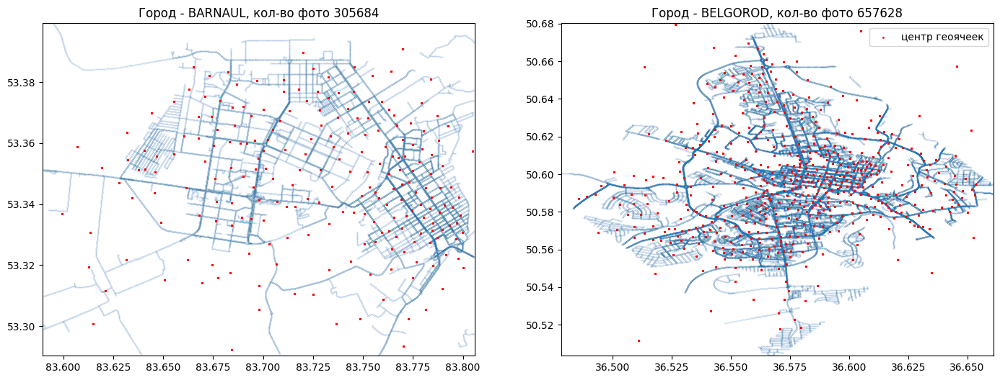
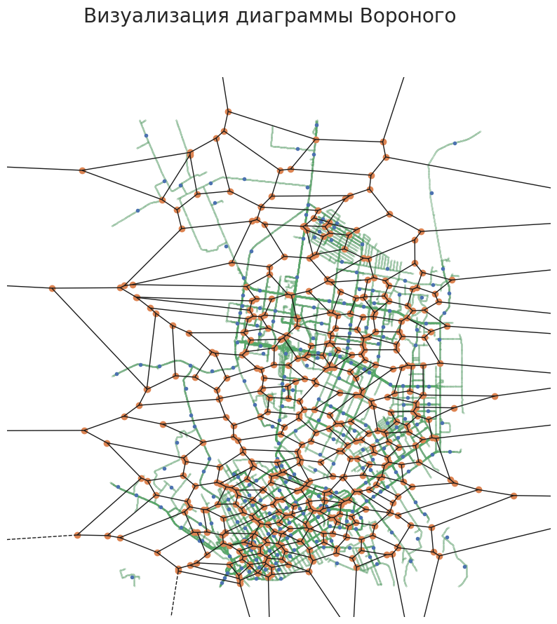
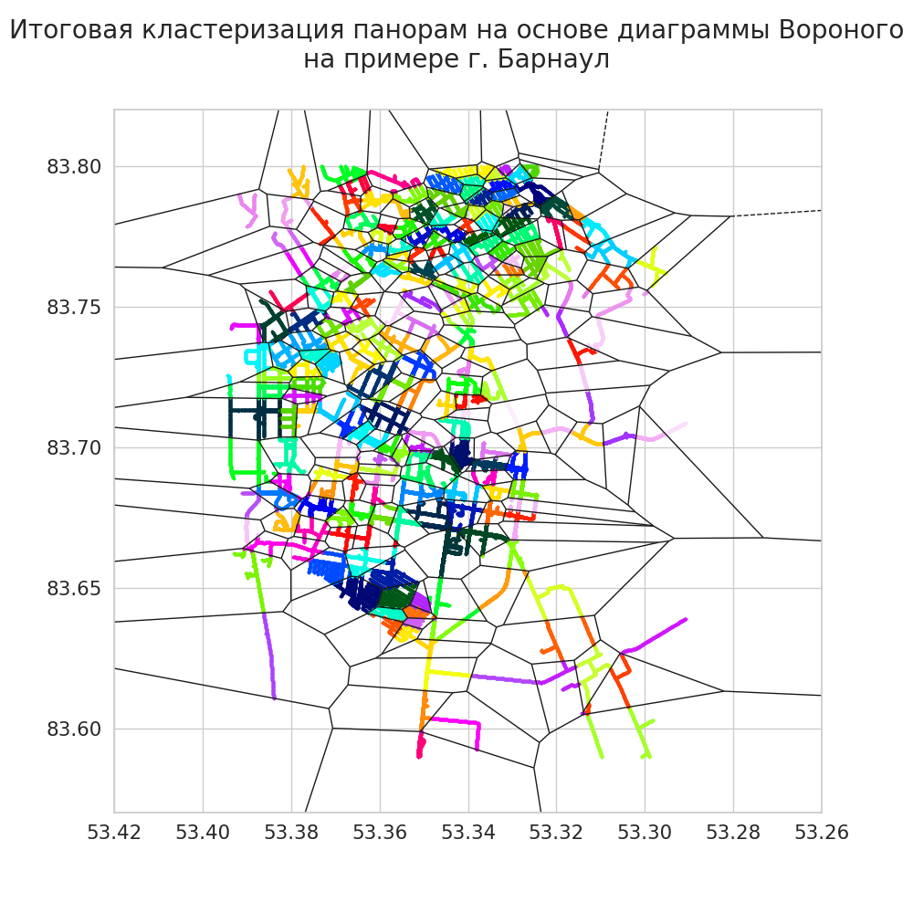
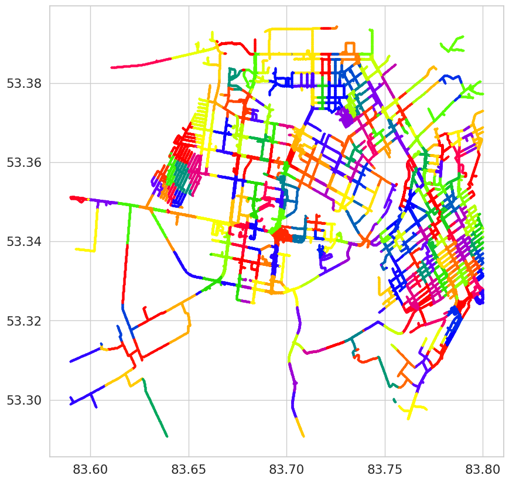

# **Реализация нейросети PIGEON для определения местоположение объектов на фотографиях**
Основные источники данных

https://habr.com/ru/news/783090/

https://www.catalyzex.com/paper/arxiv:2307.05845

https://arxiv.org/abs/2307.05845

# 1. Формирование датасета

#### Общий подход к созданию датасета

Изображения будут загружаться из сервиса Google maps. РАбота будет разделена на несколько шагов:
- формирования списка координат для каждой геозоны (города)
- получение описательных данных для каждой координаты
- загрузка на основе описательных данных изображений понорам
- нарезка панорамы на 4 отдельных изображения

Далее изображения кластеризуем по геоячекам с помощью алгоритма OPTICS

Улучшаем кластеризацию с помощью тесселяции Вороного


## 1.1. Загрузка изображений

### 1.1.1 Получение координат и лейблов изображений

Вероятно быстрый способ загрузить понорами из Google maps отсутствует. Google предоставляет API для загрузки фото, но только по уникальному наименованию, допустим "MI6AdiEx00Ses3qzyKiXeg" для координат lat 53.29146481360133; lon 83.63833204994756.

Поэтому изначально мы составляем список координат для выбранной геозоны. Было реализовано два подхода:
- получение координат с определенным шагом в пределах заданного прямоугольника
- получение координат с определенным шагом в пределах заданного ромба

Прямоугольник позволяет нам извлечь большее количество координат, ромб позволяет извлечь основные координаты прилегающие к центру геозоны (города). Лучшим решением окажется ромб, так как плотность понорам в гул очень высока, и даже с ромбом их количество окажется избыточным.

Когда координаты получены возможно приступить к получению описаний (лейблов) изображений. Полученные данные будут записываться в csv файлы для дальнейшего объединения.

Использовать будем вот этот сервис - "streetview" https://github.com/robolyst/streetview. 


### **На примере Барнаула.**

Шаг был выбран в 20 метров - примерно на таком расстоянии список панорамных снимков не пересекается и не пропускается

Далее простым циклом перебора координат с заданным шагом для локации Барнаул было получено 433922 координат. 

Список координат составлен. Теперь возможно для каждой координаты получить лейблы с данными о помаранных снимках.
Пример списка лейблов:
```
[Panorama(pano_id='suorKTZrkJTaGhUUlgkwIg', lat=53.32822141869757, lon=83.68271865044099, heading=280.7651977539062, pitch=90.88703918457031, roll=359.2576599121094, date='2012-07'),
 Panorama(pano_id='4sFaZfPw9WekRt7CLTFpEw', lat=53.32811947079741, lon=83.6827456451473, heading=101.4230499267578, pitch=89.6850357055664, roll=0.5733432173728943, date=None)]
```
Эта процедура занимает много времени. Google colab выдает среднюю скорость 4-5 координат в секунду, общее время выполнения может достигать 30 часов.
Для ускорения процесса выполнения одновременно было запущено несколько ноутбуков. Полученные данные объединены и очищены от дублирующих значений.


Здесь представлен ноутбук с реализацией загрузки координат и лейблов изображений https://colab.research.google.com/drive/1BKJvkXlxelojyEPH_ZjippBw4HlrViX6?usp=sharing

Здесь представлен файл с загруженными лейблами https://disk.yandex.ru/d/DCx14ELm4Lg7Mg  Барнаула

### 1.1.2 Получение изображений

Получение изображений относительно простой но затратный по времени процесс. В данном случае также будет использован сервис "streetview" https://github.com/robolyst/streetview.  Было реализовано два варианта загрузки:
- изображения высокого разрешения 16300*8200 - https://colab.research.google.com/drive/1KAsBBn4Bf4ZxjmjQniubULUELyC1Rqeo?usp=sharing
- изображения низкого разрешения - https://colab.research.google.com/drive/1yG5Ja4PBmQVnT1ppAaOs0SxEO3aLBk9p?usp=sharing

Значительно ускорить получилось благодаря статье https://web.archive.org/web/20100818173558/http://jamiethompson.co.uk/web/2010/05/15/google-streetview-static-api/


Среднее время загрузки одного файла высокого разрешения- 1-3 мин. Для нашей задачи это неоправданно долго. Загрузка 900 000 изображений одним процессом заняла бы до 30 дней. Плюс изображения все равно бы уменьшались в процессе обучения. Поэтому датасет формировался из изображений низкого разрешения
Время загрузки панорам низкого разрешения составило порядка 7-8 часов для одного города. В дальнейшем Возникла идея, что такое количество изображений (от  400 000 до 600 000) для одного города избыточно, возможно вполне сократить количество картинок путем увеличения шага при подготовке координат на первом шаге.
Да и для загрузи изображений также в терминале было одновременно запущено 15 скриптов.


Когда изображения получены мы можем их нарезать
В ноутбуке представлен алгоритм https://colab.research.google.com/drive/1vegzIsvROEeCDyETkuCSxTfxXLYu8TMW?usp=sharing

## 1.2. Формирование описания файлов

## 1.3. Поиск геоячеек

Пример ноутбука для получения геоячеек - классов https://colab.research.google.com/drive/1iEpay-tJHxELrxGen4_y9ktgtzq82R1i?usp=sharing

Наша задача весь объем полученных изображений относительно равномерно разделить на классы


Задача будет решена в два этапа

- изначально с помощью алгоритма OPTICS мы извлекаем базовые кластеры. В полученных кластерах рассчитываем центры масс. OPTICS оставляет много шума - не класстеризованых точек. 
- передаем центры масс в алгоритм Вороного. Получаем новые замкнутые зоны на карте. Теперь относим точке на карте к соответствующему классу исхдя из полученных зон.

##
|  |  |  |

##


## 

ГОТОВЫЙ ДАТАСЕТ - https://drive.google.com/file/d/1zB-L7LQgjfKftRoOOv4La_XaIyzzrXlQ/view?usp=drive_link


# 2. Модель

## 2.1. Подготовим loss функцию

```python
def hav_dist(points_1: torch.Tensor, points_2: torch.Tensor, earth_radius: int = 6371) -> torch.Tensor:
    """"Функция для расчета расстояния между точками в км."""  
    lat_1, lon_1 = points_1.T * math.pi / 180.0  # радианы
    lat_2, lon_2 = points_2.T * math.pi / 180.0  # радианы
    lat_delt = ((lat_2 - lat_1) / 2).sin() ** 2
    lon_delt = ((lon_2 - lon_1) / 2).sin() ** 2    
    return 2 * earth_radius * (lat_delt + lat_1.cos() * lat_2.cos() * lon_delt).sqrt().asin()


def loss_distance(output: torch.Tensor, labels: torch.Tensor):
    """
    """
    tens_slice = 2
    true_points = labels[:, :tens_slice]
    true_kernels = labels[:, tens_slice:]
    out_points = output[:, :tens_slice]
    out_kernel = output[:, tens_slice:]
    point_distance = hav_dist(out_points, true_points)
    kernel_distance = hav_dist(out_kernel, true_kernels)
    distance = - ((kernel_distance - point_distance) / 65)
    distance = torch.exp(distance)
    distance = - torch.log(distance).sum()
    return distance
```


## 2.2. Обучение модели
Ноутбук обучения модели - https://colab.research.google.com/drive/1P5U1bTBNW7W3a6Udq_iU7Qfz0KrmDLnY?usp=sharing

#


#


#
